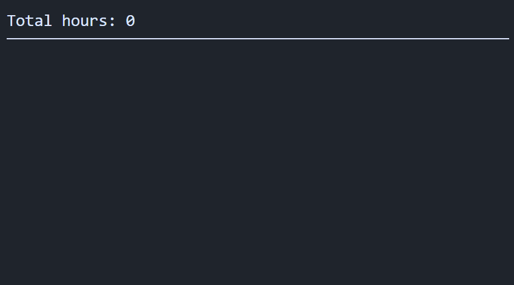

# Count hours tool &middot; 

Simple webapp tool for counting the total hours of some text. Hours must be written like hh:mm or h...h (a whole number), and be surrounded by whitespace. Everything else is ignored, including dates.

Just a weekend project for my personal productivity.

Regex used: `/(\s|^)[0-9]+:[0-9]+(\s|$)|(\s|^)[0-9]+(\s|$)/gm`

